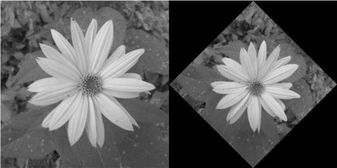

title: Rotace obrázku pomocí transformační matice
description: Vytvoří transformační matici a s její pomocí rotuje obrázek.
--- 
>Tento dokument pracuje s [obrázkem kytky](../media/kytka256.jpg) v proměnné `A` .

Transformační matice T je matice o velikosti 3x3, která se používá k provedení afinní transformace (posun, změna měřítka, rotace, zkosení) vůči původním souřadnicím osy. V tomto příkladu dochází pouze k rotaci.

  

Rotace je jedním z případu afinní transformace.

Funkce `affine2d(T)` vytvoří z transformační matice objekt. Tento objekt využívá funkce `imwarp` k transformaci obrázku (v tomto případě k rotaci)

						   		 			
 ``` matlab
A = rgb2gray(imread('kytka256.jpg')); %načítání obrázku a převedení do šedotonu
angle = pi/4; %úhel rotace

%matice T o velikosti 3x3 nastavuje afinní transformaci roviny
T = [  	cos(angle) 	sin(angle) 0;
      	-sin(angle) 	cos(angle) 0;
	    0	0	 1 ]; 
		%poslední řadek {0 0 1} určuje posun obrázku podél os X a Y (nedochází k posunu proto 0)
                                                 
tform = affine2d(T); %vytvoří transformační objekt
J = imwarp(A,tform); %transformuje obrázek A podle geometrické transformace 

montage([{A},{J}]); %zobrazuje původní a transformovaný obrázky do jedného snímku
```

Transfromaci je možné vytvořit maticovým násobením transformační matice a souřadnic původního obrázku (to vlastně dělá funkce `imwarp`). Vzniknou tak nové souřadnice, jejichž poloha je transformována (souřadnice jsou jiné).

Celý proces rotace obrázku je možné zjednodušit funkcí `imrotate`.