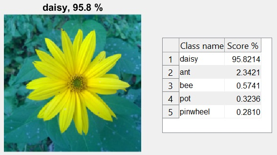

title: Aplikace konvoluční sítě alexnet pro klasifikaci obrázků
Description: Použití konvoluční neuronové sítě Alexnet pro klasifikaci obrázků a procentuální vyhodnocení přesnosti klasifikace algoritmu.
---
>Tento dokument pracuje s [obrázkem](/zodoc/assets/img/kytka256.jpg) uloženém v proměnné`A`. 

# Jak definovat konvoluční neuronovou síť Alexnet?
Konvoluční neuronová síť alexnet má naučeno více než milion různých obrázků z databáze ImageNet. Tato síť je tvořena osmi vrstvami a dokáže obrázky či vybrané výřezy obrázků klasifikovat do tisíce kategorií, pro příklad: klávesnice, různá zvířata a mnohé další. 
Výsledkem je klasifikování obrázku (název toho, co na něm je) a hodnota uvádějící procentuální jistotu zařazení obrázku.


# Nainstalovat přídavný prvek 'alexnet' do matlabu
```matlab
alexnet 
%zadáme do command line v Matlabu a postupujeme podle pokynů, pro instalaci
%je nutné mít účet na https://www.mathworks.com/
```

# Načíst síť alexnet do proměnné a klasifikovat obrázek
```matlab
net = alexnet; %provede načtení neuronové sítě do proměnné net
A = imread('kytka256.jpg'); %načte obrázek
A_resized = imresize(A,[227 227]); %upraví velikost obrázku, síť alexnet
% vyžaduje na vstupu obrázek o rozměrech: 227px x 227px
[label,score] = classify(net,A_resized); % klasifikuje obrázek, kdy se ukládá
%pojmenování klasifikace do proměnné label a proměnná score
%slouží k vyjádření míry přesnosti v procentech alexnet 
%a druhým parametrem je obrázek ve správné vstupní velikosti
[maxvalues, ind] = maxk(score(:), 5); %ulozeni peti nejvyssich klasifikaci
maxvalues=round(maxvalues,3)*100; %zaokrouhleni a nasobeni pro zisk procent
values=num2cell(maxvalues);
names=(net.Layers(end).ClassNames(ind)); %uloží názvy pěti nejvyšších klasifikací
f = subplot(122) %nasledujici cast pro vytvoreni prehledne tabulky ostatnich klasifikaci
uit = uitable(f);
t=[names,values];
uit.Data= t;
uit.Position = [290 150 150 130]; 
uit.ColumnName = {'Name','Value %'};
subplot 121; imshow(A_resized); %zobrazit puvodni obrazek
title(string(label) + ", " + num2str(max(score)*100,3) + "%"); % zobrazeni nazvu a procent
```


# Závěr
Výstupem jsou obrázek a tabulka, obrázek obsahující název a procentuální úspěšnost klasifikace, a tabulka obsahující pět nejpravděpodobnějších klasifikací s procentuální jistotou.
V tomto příkladu užitá neuronová síť vyhodnotila obrázek jako sedmikrásku (Daisy), přestože se ve skutečnosti jedná o květ topinambury.

Budoucnost v těchto sítích je obrovská, nicméně je potřeba je ještě hodně učit.

